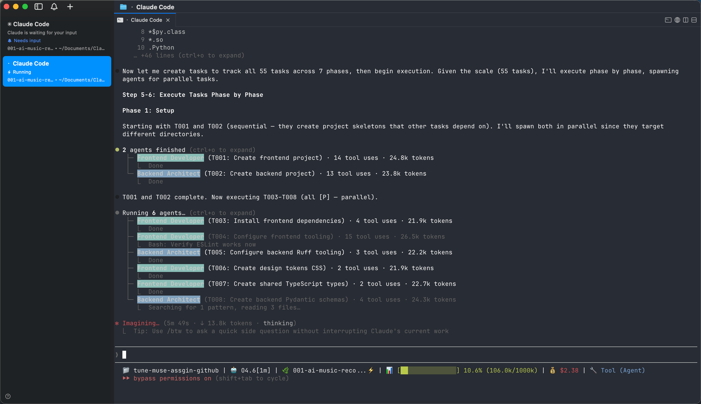

# spec-kit-agent-assign

<div align="center">
  <strong>Route the right task to the right agent.</strong>
  <br/><br/>

  [](https://github.com/github/spec-kit)
  [](https://github.com/github/spec-kit)
  [](https://github.com/github/spec-kit)
  [](https://opensource.org/licenses/MIT)
</div>

<br/>

Your `tasks.md` has 20 tasks. Some need a backend specialist, some need a frontend expert, some need a test writer. But `/speckit.implement` runs them all in one flat context. This extension fixes that — it scans your agent definitions, assigns each task to the best-fit agent, and executes them via dedicated subagents.



## The Problem

Spec-kit's standard `/speckit.implement` runs all tasks sequentially in a single agent context. This works for small projects, but as complexity grows:

- A backend task gets implemented without deep backend expertise
- Test tasks lack awareness of testing best practices
- Frontend and backend tasks compete for the same context window
- No task-level specialization — every task gets the same generalist treatment

As projects scale, this one-size-fits-all approach leaves room for improvement.

## The Solution

```
/speckit.agent-assign.assign

Agent Registry
| # | Agent Name      | Source  | Description                              |
|---|-----------------|---------|------------------------------------------|
| 1 | backend-dev     | project | Backend development specialist            |
| 2 | frontend-dev    | project | Frontend React/TypeScript specialist      |
| 3 | test-writer     | user    | Unit and integration test author          |

Task Assignments
| Task ID | Description                    | Assigned Agent  | Reason                    |
|---------|--------------------------------|-----------------|---------------------------|
| T001    | Create project structure...    | default         | General setup task         |
| T002    | Implement User model...        | backend-dev     | Data model creation        |
| T003    | Create React component...      | frontend-dev    | UI component development   |
| T004    | Write unit tests for...        | test-writer     | Test authoring             |

Assignments written to: .specify/features/my-feature/agent-assignments.yml
```

## Benchmark: Agent-Assign vs Standard Spec-Kit

We built the same project — [TuneMuse](https://github.com/xymelon/tune-muse), an AI-powered music recommendation app — twice:

- **Plan A** ([tune-muse](https://github.com/xymelon/tune-muse)): Standard spec-kit workflow using `/speckit.implement`
- **Plan B** ([tune-muse-assign](https://github.com/xymelon/tune-muse-assgin)): Same `tasks.md`, executed with `spec-kit-agent-assign`

Three frontier models (Gemini 3.1 Pro, GPT-5-4, Claude Opus 4.6) evaluated both implementations across three dimensions. Each dimension was scored 1–10.

### Evaluation Dimensions

| Dimension | What it measures |
|-----------|-----------------|
| **Result Quality** | Spec/plan/task completeness, code quality, test coverage, runnability and maintainability |
| **Task Execution** | Adherence to `tasks.md`, reduced skipped/faked steps, dependency handling, less rework |
| **Overall Value** | Quality improvement vs. added complexity, reusability, long-term maintenance worthiness |

### Detailed Scores

| Dimension | Gemini 3.1 Pro | GPT-5-4 | Opus 4.6 |
|-----------|---------------|---------|----------|
| Result Quality | A:6 / B:**9** (+3) | A:6 / B:**8** (+2) | A:5 / B:**7.5** (+2.5) |
| Task Execution | A:5 / B:**9** (+4) | A:6 / B:**7** (+1) | A:4.5 / B:**6** (+1.5) |
| Overall Value | A:6 / B:**8.5** (+2.5) | A:6 / B:**7.5** (+1.5) | A:5 / B:**7** (+2) |
| **Total (out of 30)** | A:17 / B:**26.5** | A:18 / B:**22.5** | A:14.5 / B:**20.5** |
| **B's Lead** | **+9.5** | **+4.5** | **+6** |

### Cross-Model Averages

| Dimension | Plan A Avg | Plan B Avg | Delta |
|-----------|-----------|-----------|-------|
| Result Quality | 5.7 | **8.2** | **+2.5** |
| Task Execution | 5.2 | **7.3** | **+2.1** |
| Overall Value | 5.7 | **7.7** | **+2.0** |
| **Total** | **16.5** | **23.2** | **+6.7** |

**Plan B leads by ~+2.2 points per dimension on average, with a 40% higher total score.**

### Model Consensus

| Question | Gemini 3.1 Pro | GPT-5-4 | Opus 4.6 |
|----------|---------------|---------|----------|
| Is B better than A? | Significantly better | Better | Clearly better |
| Worth long-term maintenance? | Strongly recommended | Concept worth keeping | Recommended, needs iteration |
| Highest-value aspect | YAML-driven routing + context-isolated execution | Task-level specialization with parallel execution | Specialized agent spawning in the execute phase |

## Quick Start

> **Need ready-made agents?** You can bootstrap your `.claude/agents/` directory with the open-source [agency-agents](https://github.com/msitarzewski/agency-agents) collection — a curated library of specialized agent definitions covering frontend, backend, testing, DevOps, and more. Copy the ones you need and the extension will discover them automatically.

```bash
# Install the extension
specify extension add agent-assign --from https://github.com/xymelon/spec-kit-agent-assign/archive/refs/heads/main.zip

# Generate tasks as usual
/speckit.tasks

# Assign agents to tasks
/speckit.agent-assign.assign

# Validate assignments
/speckit.agent-assign.validate

# Execute with specialized agents
/speckit.agent-assign.execute
```

## Commands

| Command | What it does |
|---------|--------------|
| `speckit.agent-assign.assign` | Scan available agents and assign them to tasks |
| `speckit.agent-assign.validate` | Validate that all assignments are correct and agents exist |
| `speckit.agent-assign.execute` | Execute tasks by spawning the assigned agent for each task |

## How It Works

### 1. Assign

Scans Claude Code agent definitions following the official priority hierarchy:

| Priority | Location | Scope |
|----------|----------|-------|
| High | `.claude/agents/*.md` | Project-level specialists |
| Low | `~/.claude/agents/*.md` | User-level reusable agents |

Same-name agents at higher priority override lower ones. Each task is auto-matched to the best-fit agent based on:
- **File path patterns** — `src/api/` routes to API agents, `tests/` routes to test agents
- **Task action keywords** — "Create model" maps to backend, "Write test" maps to test-writer
- **Story context** — Setup tasks may need different agents than implementation tasks

Assignments are stored in `agent-assignments.yml` alongside `tasks.md`:

```yaml
agents_scanned:
  - name: "backend-dev"
    source: "project"
    description: "Backend development specialist"

assignments:
  T001:
    agent: "default"
    reason: "General setup task, no specialized agent needed"
  T002:
    agent: "backend-dev"
    reason: "Data model creation matches backend-dev capabilities"
```

### 2. Validate

A read-only check that catches problems before execution:

- **Coverage** — every task in `tasks.md` has an assignment
- **Agent existence** — every assigned agent still exists on disk
- **Agent drift** — detects agents added or removed since assignment
- **Conflicts** — same agent name at multiple hierarchy levels
- **Frontmatter validity** — each agent file has proper YAML metadata

### 3. Execute

Replaces `/speckit.implement` with agent-aware execution:

- Tasks assigned to `default` run inline (same as standard implement)
- Tasks assigned to a named agent are **spawned as dedicated subagents** with full context
- Phase ordering, dependency tracking, and `[P]` parallel markers are all respected
- Progress is tracked in `tasks.md` with per-task and per-phase reporting

```
Phase 2: Foundational — Complete (5/5 tasks)
  T002 (backend-dev)  — Implemented User model
  T003 (backend-dev)  — Created API endpoints
  T004 (frontend-dev) — Built React components
  T005 (frontend-dev) — Added routing layer
  T006 (test-writer)  — Wrote integration tests
```

## Workflow Integration

This extension slots into the standard spec-kit pipeline, replacing the final implementation step:

```
/speckit.constitution            → constitution.md      (project principles)
/speckit.specify                 → spec.md              (what to build)
/speckit.plan                    → plan.md              (how to build it)
/speckit.tasks                   → tasks.md             (actionable task list)
/speckit.agent-assign.assign     → agent-assignments.yml     ← NEW
/speckit.agent-assign.validate   → validation report         ← NEW
/speckit.agent-assign.execute    → implemented project       ← REPLACES /speckit.implement
```

The `after_tasks` hook can automatically trigger agent assignment after task generation, making the transition seamless.

## Installation

```bash
# From release (recommended)
specify extension add agent-assign --from https://github.com/xymelon/spec-kit-agent-assign/archive/refs/tags/v1.1.0.zip

# From main branch (latest)
specify extension add agent-assign --from https://github.com/xymelon/spec-kit-agent-assign/archive/refs/heads/main.zip

# Development mode (local clone)
specify extension add --dev /path/to/spec-kit-agent-assign
```

**Requirements**: spec-kit >= 0.7.1

## Configuration

Agent definitions are standard Claude Code agent files (`.claude/agents/*.md`). No additional configuration is required — the extension discovers agents automatically using Claude Code's built-in hierarchy.

To get the most out of this extension, define specialized agents for your project:

```bash
# Example: create a backend specialist agent
cat > .claude/agents/backend-dev.md << 'EOF'
---
description: Backend development specialist for Python/FastAPI
---

You are a backend development specialist...
EOF
```

Or use the [agency-agents](https://github.com/msitarzewski/agency-agents) library to quickly populate your agent roster with battle-tested definitions.

## Troubleshooting

| Issue | Solution |
|-------|----------|
| "No agent definition files found" | Create agent files in `.claude/agents/` or `~/.claude/agents/`, or use [agency-agents](https://github.com/msitarzewski/agency-agents) |
| "No agent-assignments.yml found" | Run `/speckit.agent-assign.assign` before validate or execute |
| Agent drift detected during validation | Re-run `/speckit.agent-assign.assign` to update assignments |
| Task assigned to missing agent | The execute command falls back to `default` mode with a warning |

## Why This Matters

AI coding agents perform better with focused context. When a single agent handles everything:

1. Context window fills with irrelevant information
2. No domain expertise is applied to specialized tasks
3. Task execution becomes a flat checklist with no specialization
4. Quality degrades as the project grows

**spec-kit-agent-assign routes each task to a purpose-built agent**, so backend tasks get backend expertise, test tasks get testing expertise, and the overall implementation quality goes up — measurably.

---

Built for [spec-kit](https://github.com/github/spec-kit) | MIT License
